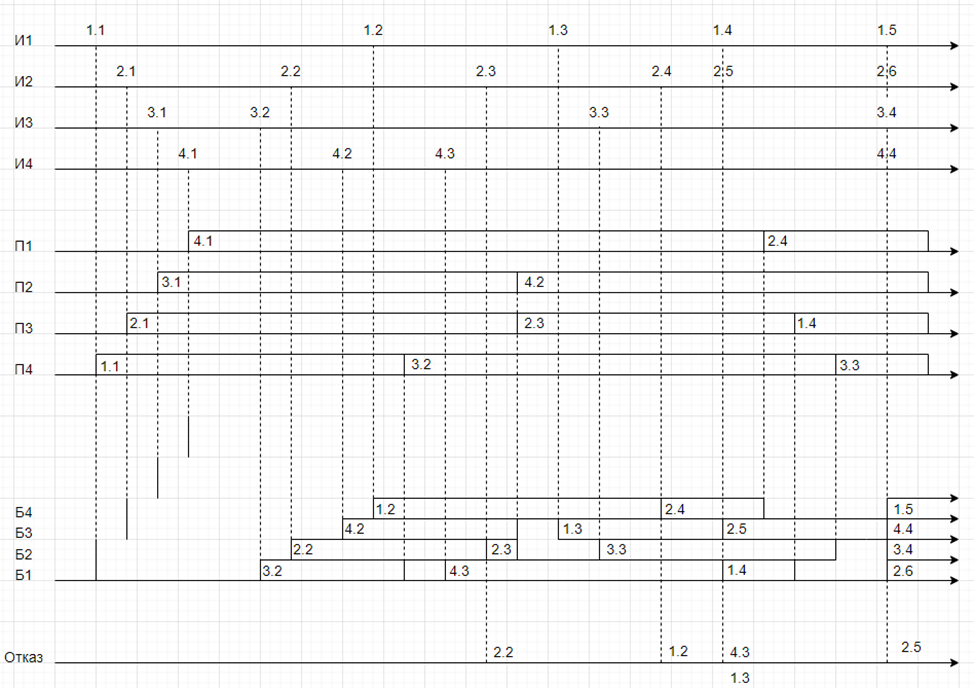
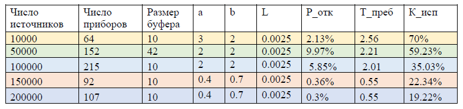
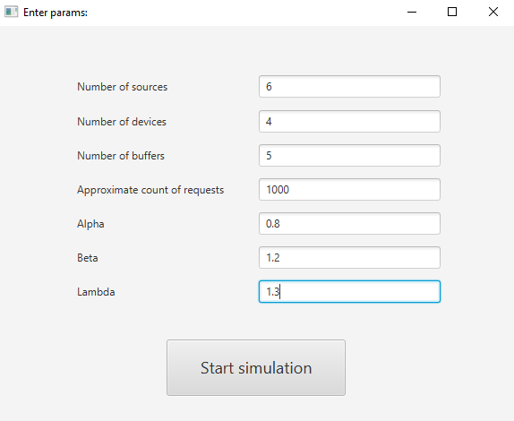
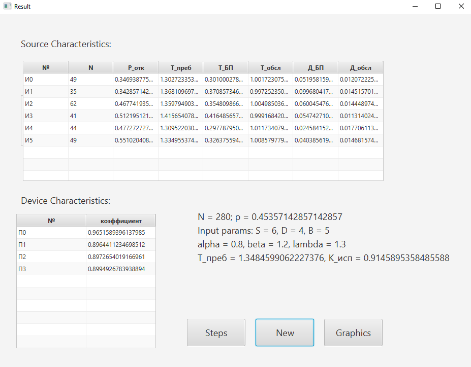
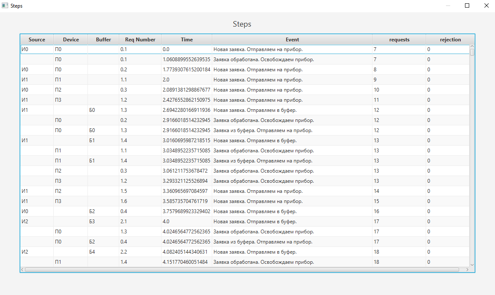
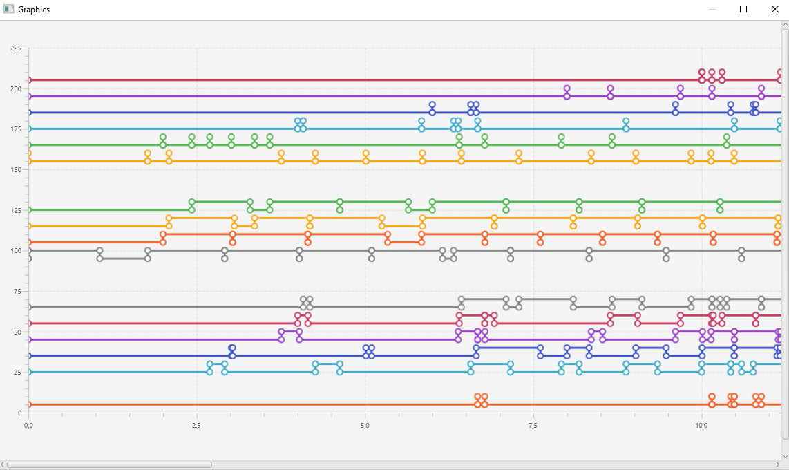

# Курсовой проект "Моделирование системы, формализованной как система массового обслуживания"

### Проект состоял из нескольких частей:

1. реализовать свой вариант работы СМО
2. Придумать систему, которая соответствует заданному варианту
3. Расчитать оптимальное количество источников, приборов и размер буфера для разных ситуаций

# 1. Исходные данные:

ИБ-ИЗ1-ПЗ2-Д10З1-Д10О3-Д2П1-Д2Б3-ОР1-ОД3

## Источники:

* ИБ – бесконечный источник
* ИЗ1 – интервал генерации заявок определяется по Пуассоновскому закону распределения (для бесконечных)

## Приборы:

* ПЗ2 – закон распределения времени обслуживания равномерный

## Описание дисциплин:

1. Буферизация (ДП - диспетчер постановки)
    * Д1 — постановки в буфер;
    * Д1О — относительные приоритеты на обслуживание;
    * Д1ОЗ — записи в буфер, если есть
    * Д10З1 – заполнение буферной памяти «по кольцу»
2. Отказ
    * Д10О3 - самая старая в буфере
3. Выбор заявок на обслуживание (ДВ – диспетчер выбора)
    * Д2Б3 - по кольцу
4. Выбор обслуживающего прибора
    * Д2П1 – приоритет по номеру прибора

## Виды отображения результатов работы программной модели:

1. (Пошаговый режим) динамическое отражение результатов
    * ОД3 - временные диаграммы, текущее состояние
2. (Автоматический режим) отражение результатов после сбора статистики
    * ОР1 - сводная таблица результатов

# Временная диаграмма

# 2. Система

Представим, что наша система должна строго соблюдать следующие ограничения:

* Вероятность отказа должна составлять не более 10%.
* Время пребывания заявки в системе не более 4х секунд.

### *Какую систему мы можем придумать под наши требования?*

Я придумала такой пример:

1. **Техническая система** - рекомендации пользователю музыкального сервиса – занимаются тем, что предлагают
   пользователю контент, наиболее совпадающий с его вкусом
2. **Источники** - заявками являются запросы пользователей на новый трек. Т.е. пользователи являются источниками.
3. **Приборы** - сервера, которые высчитывают следующий рекомендуемый трек пользователям
4. **Буфер** - очередь заявок (id пользователя) в балансировщике. Небольшой размер буфера объясняется тем, что заявку
   нужно обработать как можно быстрее, если ресурсы заняты, то лучше вернуть результат прошлой обработки.

# 3. Оптимальные характеристики

Рассчёт был произведен исходя из ограничений, а также дополнительных условий.
Допустим, мы имеем следующие диапазоны:

* *Количество источников:* 10 000 - 200 000 единиц
* *Количество приборов:* 50-270 единиц
* *Размер буфера:* 10-200 единиц

Далее я разбила системы на 3 категории: слабо-, средне- и высоконагруженные, где характеристики и требования отличаются.
Опустив логику вычислений, я получила следующие наиболее выгодные конфигурации:

где *а* и *b* - переменные в равномерном законе распределения, а *L* - переменная в законе Пуассона

Подробные вычисления можно посмотреть [тут](calculation).

# Пример работы

Вводим необходимые параметры:

Статистика источников и приборов:

Пошаговая таблица:

График особых событий:

